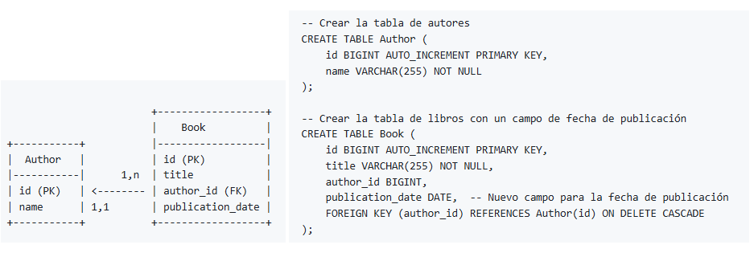
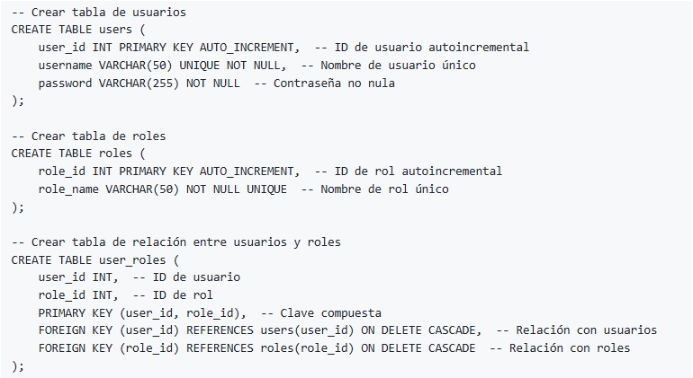
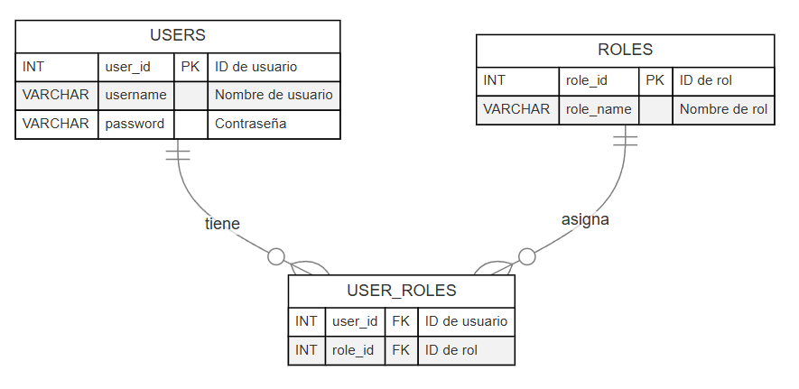
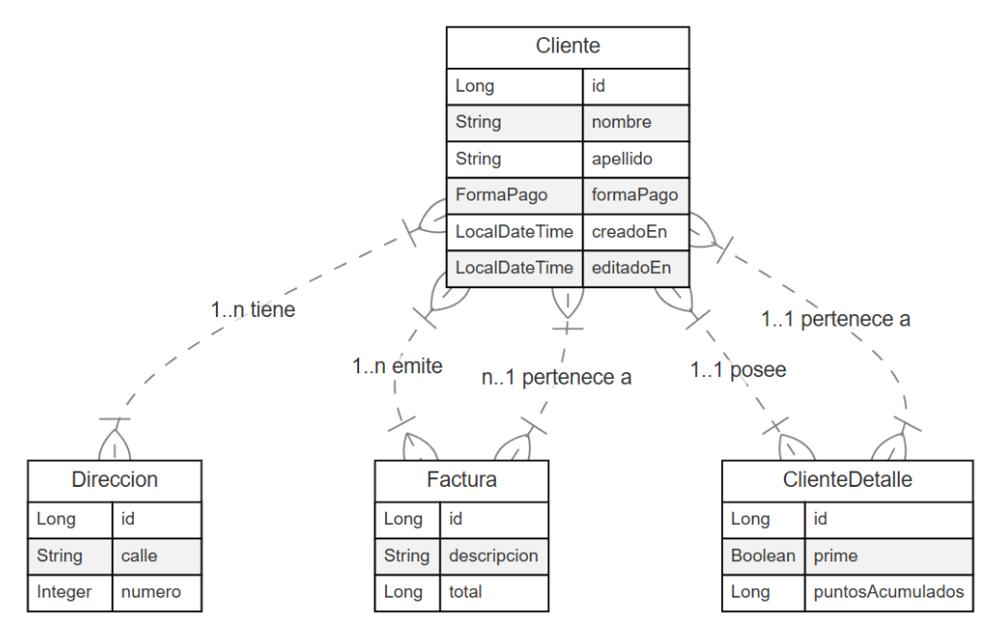

# 1. Relaciones @OneToMany + @ManyToOne -> bidireccional



```
@Entity
public class Author {

    @Id
    @GeneratedValue(strategy = GenerationType.IDENTITY)
    private Long id;

    private String name;

    @OneToMany(mappedBy = "author", cascade = CascadeType.ALL, orphanRemoval = true)
    private Set<Book> books;

  ....
```

- Una instancia de Author puede estar asociada con múltiples instancias de Book.
- Un autor tiene una lista de libros (en este ejemplo un conjunto).
  
- En la clase Book, hay un campo que se llama author, que representa la relación con el autor (private Author author;).
- Al definir **mappedBy**:
    - Le estamos diciendo a JPA que Book tiene la clave foránea.
    - Tiene el valor de author, que es el nombre del campo en Book.
  
- El **Cascade** se maneja en el entity principal o padre:
    - **CascadeType.ALL:** permite que cualquier operación (persistir, eliminar, actualizar) realizada en un autor se aplique también en sus libros.
    - **orphanRemoval = true:** elimina de la base de datos cualquier libro que se elimine de la lista books del autor.

    ## Entidad poseída Book: @ManyTOne

```
@Entity
public class Book {

    @Id
    @GeneratedValue(strategy = GenerationType.IDENTITY)
    private Long id;

    private String title;

    // Muchos libros pueden tener el mismo autor....
    @ManyToOne
    @JoinColumn(name = "author_id")
    private Author author;

    @Temporal(TemporalType.DATE)
    @Column(name="publication_date")
    private LocalDate publicationDate;
```
- Muchos libros (Book) pueden estar asociados con un único autor (Author).
- La anotación **@JoinColumn** se utiliza para especificar la columna en la tabla Book que se usará como clave foránea para referenciar al Author.
    - El atributo **name = "author_id"** indica que esta columna en la tabla Book se llamará author_id.

---

# 2. Relación @ManyToOne -> unidireccional

## Entidad propietaria Author: @OneToMany

```
┌────────────────────────┐           ┌───────────────────────────┐
│        Fabricante      |           |         Producto          │
├────────────────────────┤           ├───────────────────────────┤
│  + codigo : int        │_1___      │  + codigo : int           │
│  + nombre : String     │     |     │  + nombre : String        │
└────────────────────────┘     |     │  + precio : float         │
                               |____ │  + codigo_fabricante :int │
                                     └───────────────────────────┘

```

```
@Entity
@Table(name="producto")
public class Producto implements Serializable{

    @Id
    @GeneratedValue(strategy = GenerationType.IDENTITY)
    private int codigo;
    private String nombre;
    private float precio;

    // Indica que muchos productos pueden estar asociados a un solo fabricante.
    @ManyToOne
    @JoinColumn(name = "codigo_fabricante", referencedColumnName = "codigo", nullable = false)
    private Fabricante fabricante;
...

```

```
@Entity
@Table(name="fabricante")
public class Fabricante implements Serializable{
    @Id
    @GeneratedValue(strategy = GenerationType.IDENTITY) //delega la generación de la primary ke a la bd (autoincrement)
    @Column(name="codigo")
    private int codigo;

    @Column(name="nombre")
    private String nombre;

...
```

Es unidireccional porque Fabricante "no conoce" a productos. No tiene una lista de productos.

---

# 3. @ManyToMany






## Entidad User (lado propietario): @ManyToMany + @JoinTable

```
@Entity
@Table(name = "users") // Nombre de la tabla en la base de datos
public class User {

    @Id
    @GeneratedValue(strategy = GenerationType.IDENTITY) // ID autoincremental en H2
    @Column(name = "user_id") // Nombre de la columna en la tabla
    private Integer id;

    @Column(name = "username", length = 50, unique = true, nullable = false) 
    private String username; // Nombre de usuario único, no nulo

    @Column(name = "password", nullable = false)
    private String password; // Contraseña no nula

    /*
     * El uso de CascadeType.ALL podría ser muy arriesgado aquí porque permite también las operaciones de eliminación en cascada (REMOVE), 
     * lo cual puede provocar que al eliminar un User, también se eliminen roles que pueden estar asociados con otros usuarios. 
     * Esto normalmente no es deseable en una relación muchos-a-muchos, ya que los roles suelen ser entidades compartidas.
     * Usando únicamente CascadeType.PERSIST y CascadeType.MERGE garantizas que:
     * PERSIST: Cuando un User se guarda por primera vez, todos los roles asignados también se guardarán automáticamente si aún no existen en la base de datos.
     * MERGE: Al actualizar un User, las entidades Role relacionadas también se actualizarán si corresponde.
     */
    

    /*
     * Estrategia de carga (fetch = FetchType.LAZY)
     * Utilizada para optimizar el rendimiento cargando las relaciones muchos-a-muchos solo cuando se necesiten. 
     * Esto es útil en relaciones complejas para evitar que se carguen automáticamente grandes conjuntos de datos.
     */

    // Relación muchos-a-muchos con Role, con tabla intermedia user_roles
    @ManyToMany(fetch = FetchType.LAZY, cascade = {CascadeType.PERSIST, CascadeType.MERGE})
    @JoinTable(
        name = "user_roles", // Nombre de la tabla de unión
        joinColumns = @JoinColumn(name = "user_id"), // Columna en user_roles que hace referencia a User
        inverseJoinColumns = @JoinColumn(name = "role_id") // Columna en user_roles que hace referencia a Role
    )
    private Set<Rol> roles = new HashSet<>();

    ...
```

**@JoinTable:** Define la tabla de unión que se usará para establecer la relación entre User y Role.
- **name =** "user_roles": Especifica el nombre de la tabla de unión, en este caso user_roles.
- **joinColumns =** @JoinColumn(name = "user_id"): Define la columna en user_roles que hace referencia a la entidad User.
- **inverseJoinColumns =** @JoinColumn(name = "role_id"): Define la columna en user_roles que hace referencia a la entidad Role.

## Entidad Rol (lado inverso): @ManyToMany

```
@Entity
@Table(name = "roles") // Nombre de la tabla en la base de datos
public class Rol {

    @Id
    @GeneratedValue(strategy = GenerationType.IDENTITY) // ID autoincremental en H2
    @Column(name = "role_id") // Nombre de la columna en la tabla
    private Integer id;

    @Column(name = "role_name", length = 50, unique = true, nullable = false)
    private String roleName; // Nombre único del rol, no nulo

    // Relación muchos-a-muchos con User, con tabla intermedia user_roles
    @ManyToMany(mappedBy = "roles", fetch = FetchType.LAZY) // Relación inversa, carga perezosa
    private Set<User> users = new HashSet<>();

    ...
```

- **@ManyToMany:** Define la relación muchos a muchos, igual que en User, pero en este caso es la relación inversa, ya que Role también tiene un conjunto de usuarios.
- **mappedBy = "roles":** Indica que esta es la relación inversa y que el mapeo principal de la relación ya está en la entidad User, en el atributo roles (private Set<Rol> roles = new HashSet<>();).
    - La propiedad mappedBy indica a JPA que esta entidad Rol es el lado inverso de la relación y que User controla el mapeo.
- **fetch = FetchType.LAZY:** La carga perezosa se aplica aquí también, de modo que los usuarios asociados a un rol no se cargarán de inmediato, sino solo cuando se acceda al atributo users.

--- 

# 4. @OneToOne



En Cliente deberás usar:

```
    @OneToOne(cascade = CascadeType.ALL, orphanRemoval = true, mappedBy = "cliente")
    private ClienteDetalle detalle;
```

En ClienteDetalle deberás usar:

```
    @OneToOne
    @JoinColumn(name="cliente_detalle_id")
    private Cliente cliente;

```


--- 

# 5. Diferencia entre relaciones bidireccionales y unidireccionales

## Relación unidireccional

Solo una de las entidades "conoce a la otra". Solo uno de los dos lados tiene referencia a la otra unidad.

```
@Entity
public class Autor {
    @Id
    @GeneratedValue(strategy = GenerationType.IDENTITY)
    private Long id;
    private String nombre;
    
    @OneToMany
    private List<Libro> libros;

    // Getters y Setters
}

@Entity
public class Libro {
    @Id
    @GeneratedValue(strategy = GenerationType.IDENTITY)
    private Long id;
    private String titulo;

    // No hay referencia al autor aquí

    // Getters y Setters
}

```

## Relación bidireccional

Ambas entidades tienen referencias entre sí. 

Siguiendo con el ejemplo de autor y libros, tanto el Autor conoce los Libros que ha escrito, como el Libro conoce a su Autor.

```
@Entity
public class Autor {
    @Id
    @GeneratedValue(strategy = GenerationType.IDENTITY)
    private Long id;
    private String nombre;
    
    @OneToMany(mappedBy = "autor")
    private List<Libro> libros;

    // Getters y Setters
}

@Entity
public class Libro {
    @Id
    @GeneratedValue(strategy = GenerationType.IDENTITY)
    private Long id;
    private String titulo;

    @ManyToOne
    private Autor autor;

    // Getters y Setters
}

```
