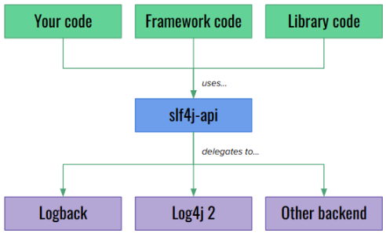

# Logging - SLF4J




SLF4J (Simple Loggin Facada for Java) es una fachada.

La salida la produce la implementación que tengas en el classpath (en Spring Boot típico: Logback). 

Si quieres usar Log4j2 añade/activa esa dependencia y su configuración (log4j2.xml).

Lombok solo genera el campo log en compilación y no requiere configuración adicional.

## ¿Qué hace Lombok con @Slf4j?


@Slf4j es una anotación de Lombok que en tiempo de compilación añade un campo estático del tipo org.slf4j.Logger llamado por defecto log en la clase: 

```
private static final org.slf4j.Logger log = org.slf4j.LoggerFactory.getLogger(NombreDeLaClase.class);
```

No añade comportamiento de logging por sí mismo: solo genera ese campo. 

El control de qué mensajes aparecen lo hace la implementación concreta de logging (Logback, Log4j2, JUL, etc.) que esté presente en tiempo de ejecución.

## Niveles

Nivel configurado en el backend (no Lombok). 

Los niveles habituales (de menos a más verboso) son: TRACE < DEBUG < INFO < WARN < ERROR

Si el nivel del logger es INFO, verás INFO, WARN y ERROR, pero no DEBUG ni TRACE.

Si es DEBUG verás DEBUG, INFO, WARN, ERROR; TRACE requiere nivel TRACE.

Puedes configurar el nivel por paquete/clase o para el logger raíz.

## Configuración del proyecto

- En una aplicación Spring Boot típica (si usas Spring Boot) el backend por defecto es Logback y la salida por defecto es la consola (STDOUT). El nivel por defecto suele ser INFO.

- Si no usas Spring Boot, la salida depende de cómo hayas configurado Logback/Log4j y de qué dependencias haya.

### Configuración en application.properties

```
# nivel global (root)
logging.level.root=INFO

# nivel por paquete o clase (ejemplo para tu app)
logging.level.es.daw.extra_estudiantesmvc=DEBUG
logging.level.es.daw.extra_estudiantesmvc.service=TRACE

# escribir también a fichero (Spring Boot)
logging.file.name=app.log         # crea app.log en working dir
# o para una ruta
logging.file.path=logs

# cambiar patrón de consola (opcional)
logging.pattern.console=%d{yyyy-MM-dd HH:mm:ss} %-5level %logger{36} - %msg%n

```

### Configuración avanzada: logback-spring.xml

Más control: appenders, filtros, rotación...

Con logback-spring.xml puedes usar logging.level.* y perfiles de Spring al arrancar.

Ejemplo básico:

```
<configuration>
  <include resource="org/springframework/boot/logging/logback/defaults.xml"/>
  <appender name="CONSOLE" class="ch.qos.logback.core.ConsoleAppender">
    <encoder>
      <pattern>%d{yyyy-MM-dd HH:mm:ss} %-5level %logger{36} - %msg%n</pattern>
    </encoder>
  </appender>

  <appender name="FILE" class="ch.qos.logback.core.rolling.RollingFileAppender">
    <file>logs/app.log</file>
    <rollingPolicy class="ch.qos.logback.core.rolling.TimeBasedRollingPolicy">
      <fileNamePattern>logs/app.%d{yyyy-MM-dd}.log</fileNamePattern>
      <maxHistory>30</maxHistory>
    </rollingPolicy>
    <encoder>
      <pattern>%d{yyyy-MM-dd HH:mm:ss} %-5level %logger{36} - %msg%n</pattern>
    </encoder>
  </appender>

  <root level="INFO">
    <appender-ref ref="CONSOLE"/>
    <appender-ref ref="FILE"/>
  </root>

  <!-- Logger por paquete -->
  <logger name="es.daw.extra_estudiantesmvc" level="DEBUG"/>
</configuration>

```

- Usa los métodos parametrizados en SLF4J para evitar concatenaciones: log.debug("Usuario: {}", usuario);
- Para excepciones, pásala como segundo parámetro: log.error("Fallo al conectar", e);