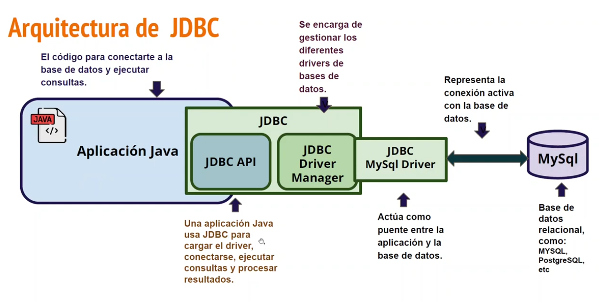
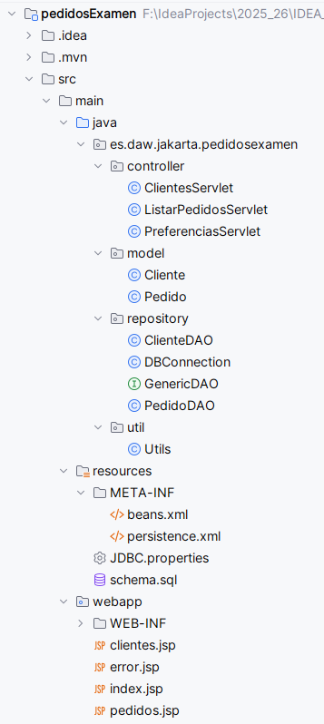

# Aplicaciones web con JakartaEE. Servlet + JSP + JDBC

Jakarta EE Servlet y JSP son tecnologías fundamentales del lado del servidor para crear aplicaciones web Java dinámicas. 

Jakarta Servlet maneja peticiones/respuestas HTTP, mientras que JSP (Jakarta Server Pages) actúa como la vista, generando HTML dinámico al convertirse en servlets. 

Ambos forman la base de la arquitectura MVC en servidores modernos (Jakarta EE 9+)

## Base de datos H2 

Muy usado en entornos Java para pruebas y desarrollo.

Soporta modo en memoria o en fichero.

Integra bien con frameworks Java (Spring, Hibernate, Jakarta EE).

---

## Refuerzo

[Ejercicios de repaso](https://github.com/profeMelola/DWES-02-2025-26/tree/main/EJERCICIOS/JDBC/EJERCICIOS)

Práctica de recuperación en el aula virtual

https://aulavirtual3.educa.madrid.org/ies.alonsodeavellan.alcala/mod/assign/view.php?id=182297

Haced de nuevo primero la práctica de recuperación basada en la **Gestión de pedidos**

### Requisitos de implementación

- Las sentencias SQL no pueden contener join entre tablas ni tampoco ordenaciones.
- El objetivo es hacer un CRUD con SQL básico y trabajar directamente sobre las colecciones para encontrar registros y ordenarlos.

Todos nuestros proyectos JakartaEE van a tener una estructura similar:

