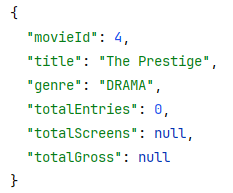
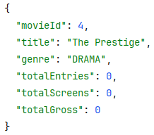
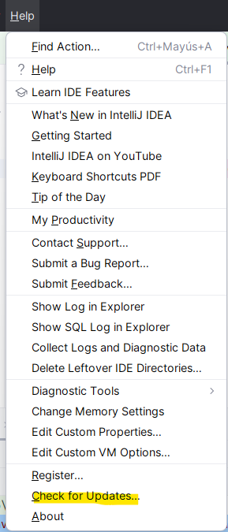
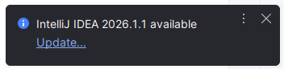

# Fase I: Práctica — Películas y actores

## Contexto

Vas a implementar la relación entre **Película** y **Actor** en una API REST con Spring Boot.

La relación tiene estas reglas de negocio:

- Un actor puede participar en varias películas.
- Un actor **no puede repetir** la misma película (no puede tener dos roles en la misma película).
- Varias películas pueden compartir el mismo actor.
- La tabla intermedia existe porque hay **atributos propios de la relación**: 
  - nombre del personaje
  - salario negociado
  - minutos en pantalla.

---

## Modelo de base de datos


**schema.sql:**

```sql
-- -------------------------
-- MOVIES
-- -------------------------
CREATE TABLE movies (
    id           BIGINT GENERATED BY DEFAULT AS IDENTITY PRIMARY KEY,
    title        VARCHAR(120) NOT NULL,
    release_year INT          NOT NULL,
    genre        VARCHAR(30)  NOT NULL,
    active       BOOLEAN      NOT NULL
);

CREATE UNIQUE INDEX uk_movie_title ON movies(title);

-- -------------------------
-- ACTORS
-- -------------------------
CREATE TABLE actors (
    id          BIGINT GENERATED BY DEFAULT AS IDENTITY PRIMARY KEY,
    stage_name  VARCHAR(80)  NOT NULL,
    full_name   VARCHAR(120) NOT NULL,
    nationality VARCHAR(60),
    active      BOOLEAN      NOT NULL
);

CREATE UNIQUE INDEX uk_actor_stage_name ON actors(stage_name);

-- -------------------------
-- MOVIE_CAST (tabla intermedia N:M con atributos)
-- Un actor NO puede repetir la misma película (PK compuesta)
-- -------------------------
CREATE TABLE movie_cast (
    movie_id        BIGINT        NOT NULL,
    actor_id        BIGINT        NOT NULL,
    character_name  VARCHAR(80)   NOT NULL,
    screen_minutes  INT           NOT NULL,
    salary_override DECIMAL(12,2),
    active          BOOLEAN       NOT NULL,

    CONSTRAINT pk_movie_cast PRIMARY KEY (movie_id, actor_id),
    CONSTRAINT fk_mc_movie   FOREIGN KEY (movie_id) REFERENCES movies(id),
    CONSTRAINT fk_mc_actor   FOREIGN KEY (actor_id) REFERENCES actors(id)
);

CREATE INDEX idx_movie_cast_movie ON movie_cast(movie_id);
CREATE INDEX idx_movie_cast_actor ON movie_cast(actor_id);
```

**data.sql:**

```sql
-- -------------------------
-- MOVIES (6)
-- IDs esperados: 1..6
-- -------------------------
INSERT INTO movies (title, release_year, genre, active) VALUES
    ('Inception',            2010, 'SCI_FI',  true),
    ('The Dark Knight',      2008, 'ACTION',  true),
    ('Interstellar',         2014, 'SCI_FI',  true),
    ('The Prestige',         2006, 'DRAMA',   true),
    ('Dunkirk',              2017, 'WAR',     true),
    ('Batman Begins',        2005, 'ACTION',  false); -- inactiva para filtros

-- -------------------------
-- ACTORS (6)
-- IDs esperados: 1..6
-- -------------------------
INSERT INTO actors (stage_name, full_name, nationality, active) VALUES
    ('DiCaprio',   'Leonardo DiCaprio', 'American',   true),
    ('Caine',      'Michael Caine',     'British',    true),
    ('Nolan',      'Christian Bale',    'British',    true),
    ('Murphy',     'Cillian Murphy',    'Irish',      true),
    ('Cotillard',  'Marion Cotillard',  'French',     true),
    ('Oldman',     'Gary Oldman',       'British',    false); -- inactivo para filtros

-- -------------------------
-- MOVIE_CAST (tabla intermedia con atributos)
-- Diseñado para cubrir todos los casos del plan de pruebas:
--   - Un actor en varias películas     (DiCaprio → Inception + Interstellar)
--   - Una película con varios actores  (Inception → DiCaprio + Caine + Cotillard)
--   - Actor inactivo con rol activo    (Oldman en Batman Begins)
-- -------------------------
INSERT INTO movie_cast (movie_id, actor_id, character_name, screen_minutes, salary_override, active) VALUES
--  Inception (1)
    (1, 1, 'Cobb',          110, 5000000.00, true),   -- DiCaprio en Inception
    (1, 2, 'Miles',          40, 1000000.00, true),   -- Caine en Inception
    (1, 5, 'Mal',            55,        null, true),  -- Cotillard en Inception

--  The Dark Knight (2)
    (2, 3, 'Batman',        120, 8000000.00, true),   -- Bale en The Dark Knight
    (2, 4, 'Scarecrow',      15,        null, true),  -- Murphy en The Dark Knight
    (2, 6, 'Gordon',         60, 2000000.00, true),   -- Oldman en The Dark Knight

--  Interstellar (3)
    (3, 1, 'Cooper',        120, 7000000.00, true),   -- DiCaprio en Interstellar (actor en 2 películas)
    (3, 2, 'Professor',      30, 1500000.00, true),   -- Caine en Interstellar

--  The Prestige (4)
    (4, 3, 'Angier',         95, 4000000.00, true),   -- Bale en The Prestige
    (4, 2, 'Cutter',         45,        null, true),  -- Caine en The Prestige (actor en 3 películas)

--  Dunkirk (5)
    (5, 4, 'Tommy',         100, 3000000.00, true),   -- Murphy en Dunkirk

--  Batman Begins (6) — película inactiva
    (6, 3, 'Bruce Wayne',   110, 5000000.00, true),   -- Bale en Batman Begins
    (6, 6, 'Gordon',         50, 1000000.00, false);  -- Oldman en Batman Begins (rol inactivo)
```
---

## Entidades a implementar

### `Movie.java`

```java
@Entity
@Table(name = "movies")
public class Movie {

    @Id @GeneratedValue(strategy = GenerationType.IDENTITY)
    private Long id;

    @Column(nullable = false, length = 120)
    private String title;

    @Column(nullable = false)
    private int releaseYear;

    @Column(nullable = false, length = 30)
    private String genre;

    @Column(nullable = false)
    private boolean active = true;

    // pendiente completar
}
```

### `Actor.java`

```java
@Entity
@Table(name = "actors")
public class Actor {

    @Id @GeneratedValue(strategy = GenerationType.IDENTITY)
    private Long id;

    @Column(nullable = false, unique = true, length = 80)
    private String stageName;

    @Column(nullable = false, length = 120)
    private String fullName;

    @Column(length = 60)
    private String nationality;

    @Column(nullable = false)
    private boolean active = true;

    // pendiente completar

}
```

### `MovieCastId.java` — clave primaria compuesta

```java
@Embeddable
public class MovieCastId implements Serializable {

    // pendiente completar
}
```

### `MovieCast.java` — tabla intermedia con atributos

```java
@Entity
@Table(name = "movie_cast")
public class MovieCast {

    // pendiente completar

    
}
```

---

## Endpoints a implementar

### `MovieController` — el recurso raíz es la película

| Método | URL | Descripción |
|---|---|---|
| `POST` | `/movies` | Crear película |
| `GET` | `/movies/{id}` | Detalle de película |
| `POST` | `/movies/{id}/cast` | Añadir actor a la película |
| `GET` | `/movies/{id}/cast` | Listar actores de la película |
| `PATCH` | `/movies/{id}/cast/{actorId}` | Actualizar atributos del rol |
| `DELETE` | `/movies/{id}/cast/{actorId}` | Eliminar actor de la película |

### `ActorController` — el recurso raíz es el actor

| Método | URL | Descripción |
|---|---|---|
| `POST` | `/actors` | Crear actor |
| `GET` | `/actors/{id}` | Detalle de actor |
| `GET` | `/actors/{id}/movies` | Listar películas de un actor |

---

## Plan de pruebas

### Datos previos necesarios

```http
### Crear películas
POST /movies
{ "title": "Inception", "releaseYear": 2010, "genre": "SCI_FI" }

POST /movies
{ "title": "The Dark Knight", "releaseYear": 2008, "genre": "ACTION" }

### Crear actores
POST /actors
{ "stageName": "DiCaprio", "fullName": "Leonardo DiCaprio", "nationality": "American" }

POST /actors
{ "stageName": "Caine", "fullName": "Michael Caine", "nationality": "British" }
```

---

### Prueba 1 — Añadir un actor a una película ✅ 201

Verifica que se crea correctamente la PK compuesta `(movie_id, actor_id)` y los atributos
propios del rol.

```http
POST /movies/1/cast
{
  "actorId": 1,
  "characterName": "Cobb",
  "screenMinutes": 110,
  "salaryOverride": 5000000.00
}
```

**Resultado esperado:** `201 Created`.

---

### Prueba 2 — Distintas películas pueden compartir el mismo actor ✅ 201

El actor 1 (DiCaprio) también participa en la película 2.
Verifica que la restricción de unicidad es por par `(movie_id, actor_id)`, no por `actor_id` solo.

```http
POST /movies/2/cast
{
  "actorId": 1,
  "characterName": "Cobb (cameo)",
  "screenMinutes": 15,
  "salaryOverride": null
}
```

**Resultado esperado:** `201 Created`.

---

### Prueba 3 — Una película puede tener varios actores ✅ 201

La película 1 añade un segundo actor (Caine).

```http
POST /movies/1/cast
{
  "actorId": 2,
  "characterName": "Miles",
  "screenMinutes": 40,
  "salaryOverride": 1000000.00
}
```

**Resultado esperado:** `201 Created`.

---

### Prueba 4 — Un actor NO puede repetir la misma película ✅ 409

Intenta añadir de nuevo el actor 1 a la película 1. La PK compuesta debe rechazarlo.

```http
POST /movies/1/cast
{
  "actorId": 1,
  "characterName": "Cobb (duplicado)",
  "screenMinutes": 5,
  "salaryOverride": null
}
```

**Resultado esperado:** `409 Conflict`.

> Esta es la prueba más importante. Si `equals`/`hashCode` están bien implementados
> en `MovieCastId`, el conflicto se detecta correctamente.

---

### Prueba 5 — Listar los actores de una película ✅ 200

Verifica que el `Set<MovieCast>` se carga con todos los atributos de la tabla intermedia,
incluido el nombre del personaje.

```http
GET /movies/1/cast
```

**Resultado esperado:** lista con DiCaprio (Cobb) y Caine (Miles).

---

### Prueba 6 — Listar las películas de un actor ✅ 200

Prueba el lado inverso de la relación desde `Actor`.

```http
GET /actors/1/movies
```

**Resultado esperado:** lista con Inception y The Dark Knight.

---

### Prueba 7 — Actualizar atributos del rol ✅ 200

Modifica campos de la tabla intermedia sin tocar `Movie` ni `Actor`.

```http
PATCH /movies/1/cast/1
{
  "screenMinutes": 120,
  "salaryOverride": 6000000.00
}
```

**Resultado esperado:** `200 OK`. Solo cambia la fila en `movie_cast`.

---

### Prueba 8 — Eliminar un actor de una película ✅ 204

Prueba el `orphanRemoval = true`. Solo debe borrarse la fila intermedia,
no el actor ni la película.

```http
DELETE /movies/1/cast/2
```

**Resultado esperado:** `204 No Content`.

Verificaciones adicionales:
- `GET /movies/1/cast` → solo devuelve DiCaprio.
- `GET /actors/2` → Michael Caine sigue existiendo.
- `GET /movies/1` → Inception sigue existiendo.

---

## Orden de ejecución completo

```
1.  POST /movies          → película 1 (Inception)                  ✓ 201
2.  POST /movies          → película 2 (The Dark Knight)            ✓ 201
3.  POST /actors          → actor 1 (DiCaprio)                      ✓ 201
4.  POST /actors          → actor 2 (Caine)                         ✓ 201
5.  POST /movies/1/cast   → (1, DiCaprio, Cobb)                     ✓ 201
6.  POST /movies/2/cast   → (2, DiCaprio, cameo)                    ✓ 201  ← actor en varias películas
7.  POST /movies/1/cast   → (1, Caine, Miles)                       ✓ 201  ← película con varios actores
8.  POST /movies/1/cast   → (1, DiCaprio, duplicado)                ✓ 409  ← duplicado bloqueado
9.  GET  /movies/1/cast                                             ✓ 200  ← DiCaprio + Caine
10. GET  /actors/1/movies                                           ✓ 200  ← Inception + The Dark Knight
11. PATCH /movies/1/cast/1                                          ✓ 200  ← solo cambia movie_cast
12. DELETE /movies/1/cast/2                                         ✓ 204  ← orphanRemoval en acción
13. GET  /movies/1/cast                                             ✓ 200  ← solo DiCaprio queda
14. GET  /actors/2                                                  ✓ 200  ← Caine sigue existiendo
```

---

## Reglas del modelo verificadas

| Regla | Prueba que la verifica |
|---|---|
| Una película puede tener varios actores | Pruebas 3 y 5 |
| Un actor NO puede repetir la misma película | Prueba 4 → 409 |
| Varias películas pueden compartir el mismo actor | Pruebas 2 y 6 |
| La tabla intermedia tiene atributos propios | Pruebas 1 y 7 |
| `orphanRemoval` borra solo la fila intermedia | Prueba 8 |


---
## Demostración del problema N+1 con JOIN FETCH. Obtener todas las películas con su casting completo

Cuando tienes una entidad `Movie` con una relación `@OneToMany` hacia `MovieCast`, JPA carga las colecciones de forma **lazy por defecto**. Esto significa que el casting de cada película **no se carga hasta que se accede a él**.

Si pides 10 películas, Hibernate ejecuta:

- **1 query** para las películas
- **N queries** para el casting, una por cada película

**Con 100 películas:** 1 query para obtenerlas todas + 100 queries más para cargar el casting de cada una.


[Más sobre Join Fetch](../ordinaria/ampliaciones/join-fetch.md)

---

La relación entre `Movie` y `Actor` no es directa. Existe una **tabla intermedia** `MovieCast` con atributos propios: el nombre del personaje, los minutos en pantalla, etc.

```
Movie  ──────@OneToMany──────►  MovieCast  ◄──────@ManyToOne──────  Actor
              (movieCast)         (movie_id, actor_id)
```

```java
@Entity
public class Movie {
    @Id @GeneratedValue
    private Long id;
    private String title;
    private int releaseYear;
    private String genre;
    private boolean active;

    @OneToMany(mappedBy = "movie", cascade = CascadeType.ALL, orphanRemoval = true)
    private Set<MovieCast> movieCast = new HashSet<>();
}
```

```java
@Entity
public class MovieCast {
    @EmbeddedId
    private MovieCastId id;          // PK compuesta (movie_id, actor_id)

    @ManyToOne(fetch = FetchType.LAZY)
    @MapsId("movieId")
    private Movie movie;

    @ManyToOne(fetch = FetchType.LAZY)
    @MapsId("actorId")
    private Actor actor;

    private String characterName;
    private short screenMinutes;
}
```

```java
@Entity
public class Actor {
    @Id @GeneratedValue
    private Long id;
    private String stageName;
}
```

---

## El problema en acción

```java
// ❌ Provoca N+1
public List<MovieWithCastDto> getAllMoviesWithCast() {
    return movieRepository.findAll()        // 1 query: SELECT * FROM movies
        .stream()
        .map(movie -> {
            movie.getMovieCast();           // N queries: SELECT * FROM movie_cast WHERE movie_id = ?
            return toDto(movie);
        })
        .toList();
}
```

En los logs de Hibernate verás algo así:

```sql
SELECT * FROM movies

SELECT * FROM movie_cast WHERE movie_id = 1
SELECT * FROM movie_cast WHERE movie_id = 2
SELECT * FROM movie_cast WHERE movie_id = 3
...
SELECT * FROM movie_cast WHERE movie_id = N
```

---

## La solución: JOIN FETCH

Se añade `JOIN FETCH` en la query JPQL del repositorio para que Hibernate traiga todo en **una sola query**:

```java
@Query("SELECT DISTINCT m FROM Movie m 
    JOIN FETCH m.movieCast mc 
    JOIN FETCH mc.actor")
List<Movie> findAllWithCast();
```

> **¿Por qué el `DISTINCT`?**  
> `m.movieCast` es una colección `@OneToMany`. 
> El JOIN produce una fila por cada entrada en `movie_cast`, repitiendo la película. 
> Con 5 actores en una película, esa película aparece 5 veces en el resultado. 
> El `DISTINCT` le dice a Hibernate que colapse esas repeticiones en una sola entidad `Movie`.
> 

> En el ejemplo del médico, partes de DoctorSpecialty y haces fetch de ds.specialty, que es una relación @ManyToOne. Cada DoctorSpecialty apunta a una sola Specialty. El JOIN nunca puede multiplicar filas porque no hay colección que expandir. Cada DoctorSpecialty sigue siendo una fila en el resultado.

> **¿Por qué hay dos `JOIN FETCH`?**  
> Necesitamos los datos del actor (`stageName`) para construir el DTO. Si solo hacemos fetch de `movieCast` pero no de `actor`, Hibernate lanzaría una query lazy por cada `mc.getActor()` — un segundo N+1 anidado.


El servicio queda así:

```java
// ✅ Una sola query
public List<MovieWithCastDto> getAllMoviesWithCast() {
    return movieRepository.findAllWithCast()
        .stream()
        .map(this::toDto)
        .toList();
}

private MovieWithCastDto toDto(Movie m) {
    List<ActorCastDto> cast = m.getMovieCast().stream()
        .map(mc -> new ActorCastDto(
            mc.getActor().getId(),
            mc.getActor().getStageName(),
            mc.getCharacterName(),
            mc.getScreenMinutes()
        ))
        .toList();

    return new MovieWithCastDto(
        m.getId(),
        m.getTitle(),
        m.getReleaseYear(),
        m.getGenre(),
        m.isActive(),
        cast
    );
}
```
```
// Actor dentro del cast
public record ActorCastDto(
        Long actorId,
        String stageName,
        String characterName,
        short screenMinutes
) {}

// Película con su lista de actores
public record MovieWithCastDto(
        Long id,
        String title,
        int releaseYear,
        String genre,
        boolean active,
        List<ActorCastDto> cast
) {}
```


Ahora en los logs solo aparece **una query**:

```sql
SELECT DISTINCT m.*, mc.*, a.*
FROM movies m
INNER JOIN movie_cast mc ON mc.movie_id = m.id
INNER JOIN actors a ON a.id = mc.actor_id
```

---

## Cómo verificarlo: logs de Hibernate

En `application.properties`:

```properties
spring.jpa.show-sql=true
spring.jpa.properties.hibernate.format_sql=true
logging.level.org.hibernate.SQL=DEBUG
```

Con estas propiedades activas puedes contar las queries en consola y confirmar si el problema existe o está resuelto.

---


# Fase II: Taquilla y report de películas más recaudadas

## Objetivo

Ampliar el modelo con entidades de taquilla para implementar un endpoint de report
que cruce varias tablas y devuelva las **películas más recaudadas**, agrupadas por película,
con filtro opcional por género y rango de fechas.

El alumno practicará:
- Diseño de nuevas entidades relacionadas con el modelo existente.
- JPQL con `JOIN`, agregaciones (`SUM`, `COUNT`), `GROUP BY`, `ORDER BY` y proyecciones con `new`.
- DTO de report (`record` o clase con constructor).
- Paginación con `Pageable`.
- Filtros opcionales con `IS NULL OR` en JPQL.

## Nuevas entidades

Se añaden 4 entidades al modelo existente:

```
Country       → catálogo de países
Distributor   → distribuidora que estrena la película en un país
Release       → estreno de una película por una distribuidora en un país y fecha
BoxOfficeEntry → registro diario/semanal de recaudación de un estreno
```

| Entidad | Nombre en español | Qué representa |
|---|---|---|
| `Movie` | **Película** | La película en sí (título, género, año) |
| `Country` | **País** | Catálogo de países donde se distribuyen las películas |
| `Distributor` | **Distribuidora** | La empresa que se encarga de estrenar la película en un país |
| `Release` | **Estreno** | El acto de estrenar una película concreta por una distribuidora concreta |
| `BoxOfficeEntry` | **Registro de taquilla** | La recaudación obtenida por un estreno durante un periodo de tiempo (semanal o diario) |

**Ejemplo real:**

- Inception (Movie) fue estrenada en USA (Country) por Warner Bros (Distributor) el 16 de julio de 2010 (Release).
- Durante la primera semana recaudó 62.000.000 $ en 3.792 pantallas (BoxOfficeEntry).
- Durante la segunda semana recaudó 36.000.000 $ en 3.792 pantallas (BoxOfficeEntry).


### Relación con el modelo existente

```
Movie (ya existe)
  │
  └──▶ Release (nueva) ◀── Distributor (nueva)
            │
            └──▶ BoxOfficeEntry (nueva) ◀── Country (nueva)
```


### Movie (Película)
- Una película tiene **muchos** estrenos → `Movie` **OneToMany** `Release`

---

### Country (País)
- Un país tiene **muchas** distribuidoras → `Country` **OneToMany** `Distributor`
- Un país tiene **muchos** registros de taquilla → `Country` **OneToMany** `BoxOfficeEntry`

---

### Distributor (Distribuidora)
- Una distribuidora pertenece a **un solo** país → `Distributor` **ManyToOne** `Country`
- Una distribuidora tiene **muchos** estrenos → `Distributor` **OneToMany** `Release`

---

### Release (Estreno)
- Un estreno pertenece a **una sola** película → `Release` **ManyToOne** `Movie`
- Un estreno pertenece a **una sola** distribuidora → `Release` **ManyToOne** `Distributor`
- Un estreno tiene **muchos** registros de taquilla → `Release` **OneToMany** `BoxOfficeEntry`

---

### BoxOfficeEntry (Registro de taquilla)
- Un registro de taquilla pertenece a **un solo** estreno → `BoxOfficeEntry` **ManyToOne** `Release`
- Un registro de taquilla pertenece a **un solo** país → `BoxOfficeEntry` **ManyToOne** `Country`

---

### Resumen de quién tiene la FK en la base de datos

| Entidad (tabla) | FK que contiene |
|---|---|
| `distributors` | `country_id` |
| `releases` | `movie_id`, `distributor_id` |
| `box_office_entries` | `release_id`, `country_id` |

Regla: **la tabla que tiene la FK es siempre el lado `ManyToOne`** (el lado "muchos").


## Modelo de base de datos

```sql
-- -------------------------
-- COUNTRIES (catálogo)
-- -------------------------
CREATE TABLE countries (
    id          BIGINT GENERATED BY DEFAULT AS IDENTITY PRIMARY KEY,
    code        VARCHAR(3)   NOT NULL,   -- ISO 3166-1 alpha-3: ESP, USA, FRA...
    name        VARCHAR(80)  NOT NULL,
    active      BOOLEAN      NOT NULL
);

CREATE UNIQUE INDEX uk_country_code ON countries(code);

-- -------------------------
-- DISTRIBUTORS
-- -------------------------
CREATE TABLE distributors (
    id          BIGINT GENERATED BY DEFAULT AS IDENTITY PRIMARY KEY,
    name        VARCHAR(120) NOT NULL,
    country_id  BIGINT       NOT NULL,
    active      BOOLEAN      NOT NULL,

    CONSTRAINT fk_distributor_country FOREIGN KEY (country_id) REFERENCES countries(id)
);

CREATE INDEX idx_distributor_country ON distributors(country_id);

-- -------------------------
-- RELEASES
-- Una película puede estrenarse en varios países por distintas distribuidoras.
-- Una misma película NO puede tener dos estrenos con la misma distribuidora.
-- -------------------------
CREATE TABLE releases (
    id              BIGINT GENERATED BY DEFAULT AS IDENTITY PRIMARY KEY,
    movie_id        BIGINT  NOT NULL,
    distributor_id  BIGINT  NOT NULL,
    release_date    DATE    NOT NULL,
    active          BOOLEAN NOT NULL,

    CONSTRAINT fk_release_movie        FOREIGN KEY (movie_id)       REFERENCES movies(id),
    CONSTRAINT fk_release_distributor  FOREIGN KEY (distributor_id) REFERENCES distributors(id),
    CONSTRAINT uk_release_movie_dist   UNIQUE (movie_id, distributor_id)
);

CREATE INDEX idx_release_movie       ON releases(movie_id);
CREATE INDEX idx_release_distributor ON releases(distributor_id);
CREATE INDEX idx_release_date        ON releases(release_date);

-- -------------------------
-- BOX_OFFICE_ENTRIES
-- Registro de recaudación de un estreno en un país durante un periodo.
-- -------------------------
CREATE TABLE box_office_entries (
    id           BIGINT         GENERATED BY DEFAULT AS IDENTITY PRIMARY KEY,
    release_id   BIGINT         NOT NULL,
    country_id   BIGINT         NOT NULL,
    period_start DATE           NOT NULL,
    period_end   DATE           NOT NULL,
    gross        DECIMAL(14,2)  NOT NULL,   -- recaudación bruta del periodo
    screens      INT            NOT NULL,   -- número de pantallas
    active       BOOLEAN        NOT NULL,

    CONSTRAINT fk_boe_release FOREIGN KEY (release_id) REFERENCES releases(id),
    CONSTRAINT fk_boe_country FOREIGN KEY (country_id) REFERENCES countries(id)
);

CREATE INDEX idx_boe_release      ON box_office_entries(release_id);
CREATE INDEX idx_boe_country      ON box_office_entries(country_id);
CREATE INDEX idx_boe_period_start ON box_office_entries(period_start);
```

## Entidades JPA a implementar

### `Country.java`

```java
@Entity
@Table(name = "countries")
public class Country {

    @Id @GeneratedValue(strategy = GenerationType.IDENTITY)
    private Long id;

    @Column(nullable = false, unique = true, length = 3)
    private String code;

    @Column(nullable = false, length = 80)
    private String name;

    @Column(nullable = false)
    private boolean active = true;
}
```

### `Distributor.java`

```java
@Entity
@Table(name = "distributors")
public class Distributor {

    @Id @GeneratedValue(strategy = GenerationType.IDENTITY)
    private Long id;

    @Column(nullable = false, length = 120)
    private String name;

    @Column(nullable = false)
    private boolean active = true;

    // Pendiente completar relaciones

}
```

### `Release.java`

```java
@Entity
@Table(name = "releases")
public class Release {

    @Id @GeneratedValue(strategy = GenerationType.IDENTITY)
    private Long id;

    @Column(nullable = false)
    private LocalDate releaseDate;

    @Column(nullable = false)
    private boolean active = true;

    // Pendiente completar relaciones
}
```

### `BoxOfficeEntry.java`

```java
@Entity
@Table(name = "box_office_entries")
public class BoxOfficeEntry {

    @Id @GeneratedValue(strategy = GenerationType.IDENTITY)
    private Long id;

    @Column(nullable = false)
    private LocalDate periodStart;

    @Column(nullable = false)
    private LocalDate periodEnd;

    @Column(nullable = false, precision = 14, scale = 2)
    private BigDecimal gross;

    @Column(nullable = false)
    private int screens;

    @Column(nullable = false)
    private boolean active = true;

    // Pendiente completar relaciones

}
```

---

## El report

### DTO de salida

```java
public record TopGrossingMovieReport(
    Long   movieId,
    String title,
    String genre,
    Long   totalEntries,      // número de registros de taquilla
    Long   totalScreens,      // suma de pantallas acumuladas
    BigDecimal totalGross     // recaudación total
) {}
```

### Query JPQL

```java
@Query("""


""")
List<TopGrossingMovieReport> topGrossingMovies(
    @Param("genre") String genre,
    @Param("from")  LocalDate from,
    @Param("to")    LocalDate to,
    Pageable pageable
);
```

> La query cruza 4 tablas: `box_office_entries` → `releases` → `movies` y `distributors`.
> Los filtros son todos opcionales gracias al patrón `:param IS NULL OR`.

[Visualizador online explicativo del informe](https://profemelola.github.io/DWES-REFUERZO-EXTRAORDINARIA/jpql-report-explainer.html)


### Endpoint

```http
GET /reports/top-grossing?genre=SCI_FI&from=2010-01-01&to=2015-12-31&page=0&size=10
```

```java
@RestController
@RequestMapping("/reports")
@RequiredArgsConstructor
public class ReportController {

    private final ReportService reportService;

    // Público — cualquiera puede consultar el report
    @GetMapping("/top-grossing")
    public List<TopGrossingMovieReport> topGrossing(


    ) {


    }
}
```

---

## Datos de prueba (`data.sql`)

```sql
-- =============================================================================
-- DATA.SQL — Fase I + Fase II
-- Orden de inserción respetando las FK:
--   1. genres (si existe tabla separada) / movies
--   2. countries
--   3. distributors  (FK → countries)
--   4. releases      (FK → movies, distributors)
--   5. box_office_entries (FK → releases, countries)
-- =============================================================================


-- =============================================================================
-- FASE I — Datos base de películas
-- =============================================================================

-- -----------------------------------------------------------------------------
-- MOVIES ??????????????? de dónde sale duration_minutes????
-- Asumimos que Genre es un enum almacenado como String en la columna "genre"
-- Ajusta los títulos/géneros según los hayas definido en Fase I
-- -----------------------------------------------------------------------------
-- INSERT INTO movies (id, title, genre, release_year, duration_minutes, active) VALUES
--    (1, 'Inception',        'SCI_FI', 2010, 148, true),
--    (2, 'The Dark Knight',  'ACTION', 2008, 152, true),
--    (3, 'Interstellar',     'SCI_FI', 2014, 169, true),
--    (4, 'The Prestige',     'DRAMA',  2006, 130, true),
--    (5, 'Dunkirk',          'ACTION', 2017, 106, true);


-- =============================================================================
-- FASE II — Taquilla
-- =============================================================================

-- -----------------------------------------------------------------------------
-- COUNTRIES — catálogo de países (ISO 3166-1 alpha-3)
-- -----------------------------------------------------------------------------
INSERT INTO countries (id, code, name, active) VALUES
    (1, 'USA', 'United States',  true),
    (2, 'ESP', 'Spain',          true),
    (3, 'FRA', 'France',         true),
    (4, 'GBR', 'United Kingdom', true);

-- -----------------------------------------------------------------------------
-- DISTRIBUTORS — FK → countries
-- -----------------------------------------------------------------------------
INSERT INTO distributors (id, name, country_id, active) VALUES
    (1, 'Warner Bros USA',    1, true),
    (2, 'Warner Bros España', 2, true),
    (3, 'Universal France',   3, true),
    (4, 'Sony Pictures UK',   4, true);

-- -----------------------------------------------------------------------------
-- RELEASES — FK → movies, distributors
-- Restricción: una misma película NO puede tener dos estrenos
--              con la misma distribuidora (uk_release_movie_dist)
--
-- release 1 → Inception        / Warner USA
-- release 2 → Inception        / Warner España
-- release 3 → The Dark Knight  / Warner USA
-- release 4 → The Dark Knight  / Sony UK
-- release 5 → Interstellar     / Warner USA
-- release 6 → Interstellar     / Universal France
-- release 7 → Dunkirk          / Warner USA  (Fase I extra)
-- -----------------------------------------------------------------------------
INSERT INTO releases (id, movie_id, distributor_id, release_date, active) VALUES
    (1, 1, 1, '2010-07-16', true),   -- Inception        - Warner USA
    (2, 1, 2, '2010-08-20', true),   -- Inception        - Warner España
    (3, 2, 1, '2008-07-18', true),   -- The Dark Knight  - Warner USA
    (4, 2, 4, '2008-08-01', true),   -- The Dark Knight  - Sony UK
    (5, 3, 1, '2014-11-07', true),   -- Interstellar     - Warner USA
    (6, 3, 3, '2014-11-12', true),   -- Interstellar     - Universal France
    (7, 5, 1, '2017-07-21', true);   -- Dunkirk          - Warner USA

-- -----------------------------------------------------------------------------
-- BOX_OFFICE_ENTRIES — FK → releases, countries
-- Cada fila = recaudación de un estreno en un país durante un periodo
--
-- Columnas: release_id | country_id | period_start | period_end | gross | screens
-- -----------------------------------------------------------------------------
INSERT INTO box_office_entries (release_id, country_id, period_start, period_end, gross, screens, active) VALUES

    -- -------------------------------------------------------------------------
    -- Inception USA (release 1) — total: 118.000.000 $
    -- -------------------------------------------------------------------------
    (1, 1, '2010-07-16', '2010-07-22',  62000000.00, 3792, true),
    (1, 1, '2010-07-23', '2010-07-29',  36000000.00, 3792, true),
    (1, 1, '2010-07-30', '2010-08-05',  20000000.00, 3500, true),

    -- -------------------------------------------------------------------------
    -- Inception España (release 2) — total: 7.300.000 €
    -- -------------------------------------------------------------------------
    (2, 2, '2010-08-20', '2010-08-26',   4500000.00,  350, true),
    (2, 2, '2010-08-27', '2010-09-02',   2800000.00,  300, true),

    -- -------------------------------------------------------------------------
    -- The Dark Knight USA (release 3) — total: 276.000.000 $
    -- -------------------------------------------------------------------------
    (3, 1, '2008-07-18', '2008-07-24', 158000000.00, 4366, true),
    (3, 1, '2008-07-25', '2008-07-31',  75000000.00, 4366, true),
    (3, 1, '2008-08-01', '2008-08-07',  43000000.00, 4200, true),

    -- -------------------------------------------------------------------------
    -- The Dark Knight UK (release 4) — total: 19.000.000 £
    -- -------------------------------------------------------------------------
    (4, 4, '2008-08-01', '2008-08-07',  12000000.00,  650, true),
    (4, 4, '2008-08-08', '2008-08-14',   7000000.00,  600, true),

    -- -------------------------------------------------------------------------
    -- Interstellar USA (release 5) — total: 76.500.000 $
    -- -------------------------------------------------------------------------
    (5, 1, '2014-11-07', '2014-11-13',  47500000.00, 3561, true),
    (5, 1, '2014-11-14', '2014-11-20',  29000000.00, 3500, true),

    -- -------------------------------------------------------------------------
    -- Interstellar France (release 6) — total: 8.300.000 €
    -- -------------------------------------------------------------------------
    (6, 3, '2014-11-12', '2014-11-18',   5200000.00,  420, true),
    (6, 3, '2014-11-19', '2014-11-25',   3100000.00,  380, true),

    -- -------------------------------------------------------------------------
    -- Dunkirk USA (release 7) — total: 56.000.000 $
    -- -------------------------------------------------------------------------
    (7, 1, '2017-07-21', '2017-07-27',  50400000.00, 3720, true),
    (7, 1, '2017-07-28', '2017-08-03',   5600000.00, 3500, true);
```

---

## Plan de pruebas del report

```http
### Sin filtros — devuelve todas las películas ordenadas por recaudación total
GET /reports/top-grossing
→ ✓ 200  orden esperado: The Dark Knight > Inception > Interstellar

### Filtro por género SCI_FI — solo Inception e Interstellar
GET /reports/top-grossing?genre=SCI_FI
→ ✓ 200  orden esperado: Inception > Interstellar

### Filtro por rango de fechas — solo registros de 2010
GET /reports/top-grossing?from=2010-01-01&to=2010-12-31
→ ✓ 200  solo Inception aparece

### Filtros combinados
GET /reports/top-grossing?genre=ACTION&from=2008-01-01&to=2008-12-31
→ ✓ 200  solo The Dark Knight

### Paginación
GET /reports/top-grossing?page=0&size=2
→ ✓ 200  solo las 2 películas con mayor recaudación
```
___

## ¿Y si quisiera que salieran todas las películas aunque no tengan ninguna facturación todavía?


Ten en cuenta que en vez de esto:



Obtener esto:



___

# Fase III: entorno testing


Antes de nada, **hay que actualizar IntelliJ para que no hayan problemas con los test:** IntelliJ 2024.3.x no es compatible con JUnit Platform 1.12 que viene con Spring Boot 4.x.





## Estructura de ficheros

```
src/
├── main/
│   └── resources/
│       ├── application.properties   ← BD fichero H2, para desarrollo
│       └── data.sql                 ← datos de desarrollo
└── test/
    └── resources/
        ├── application.properties   ← BD memoria H2, sobreescribe solo lo necesario
        └── data.sql                 ← datos controlados para tests
```

---

## `src/test/resources/application.properties`

```properties
spring.datasource.url=jdbc:h2:mem:pelis-test-db;DB_CLOSE_DELAY=-1;MODE=MSSQLServer
spring.datasource.driverClassName=org.h2.Driver
spring.datasource.username=sa
spring.datasource.password=

spring.jpa.hibernate.ddl-auto=create-drop
spring.jpa.defer-datasource-initialization=true

spring.sql.init.mode=always
spring.sql.init.encoding=UTF-8

spring.h2.console.enabled=false
spring.jpa.show-sql=false
spring.jpa.properties.hibernate.format_sql=false
```

---

## `src/test/resources/data.sql`

```sql
INSERT INTO movies (id, title, genre, release_year, duration_minutes, active) VALUES
    (1, 'Inception',        'SCI_FI', 2010, 148, true),
    (2, 'The Dark Knight',  'ACTION', 2008, 152, true),
    (3, 'Interstellar',     'SCI_FI', 2014, 169, true),
    (4, 'The Prestige',     'DRAMA',  2006, 130, true);

INSERT INTO countries (id, code, name, active) VALUES
    (1, 'USA', 'United States', true),
    (2, 'ESP', 'Spain',         true);

INSERT INTO distributors (id, name, country_id, active) VALUES
    (1, 'Warner Bros USA',    1, true),
    (2, 'Warner Bros España', 2, true);

INSERT INTO releases (id, movie_id, distributor_id, release_date, active) VALUES
    (1, 1, 1, '2010-07-16', true),
    (2, 1, 2, '2010-08-20', true),
    (3, 2, 1, '2008-07-18', true),
    (4, 3, 1, '2014-11-07', true);

INSERT INTO box_office_entries (release_id, country_id, period_start, period_end, gross, screens, active) VALUES
    (1, 1, '2010-07-16', '2010-07-22', 62000000.00, 3792, true),
    (1, 1, '2010-07-23', '2010-07-29', 36000000.00, 3792, true),
    (1, 1, '2010-07-30', '2010-08-05', 20000000.00, 3500, true),
    (2, 2, '2010-08-20', '2010-08-26',  4500000.00,  350, true),
    (2, 2, '2010-08-27', '2010-09-02',  2800000.00,  300, true),
    (3, 1, '2008-07-18', '2008-07-24', 158000000.00, 4366, true),
    (3, 1, '2008-07-25', '2008-07-31',  75000000.00, 4366, true),
    (3, 1, '2008-08-01', '2008-08-07',  43000000.00, 4200, true),
    (4, 1, '2014-11-07', '2014-11-13',  47500000.00, 3561, true),
    (4, 1, '2014-11-14', '2014-11-20',  29000000.00, 3500, true);
```

---

## `ReportControllerTest.java`

```java
import org.junit.jupiter.api.DisplayName;
import org.junit.jupiter.api.Test;
import org.springframework.beans.factory.annotation.Autowired;
import org.springframework.boot.test.context.SpringBootTest;
import org.springframework.boot.webmvc.test.autoconfigure.AutoConfigureMockMvc;
import org.springframework.test.web.servlet.MockMvc;

import static org.springframework.test.web.servlet.request.MockMvcRequestBuilders.get;
import static org.springframework.test.web.servlet.result.MockMvcResultMatchers.jsonPath;
import static org.springframework.test.web.servlet.result.MockMvcResultMatchers.status;

@SpringBootTest
@AutoConfigureMockMvc
class ReportControllerTest {

    @Autowired
    private MockMvc mockMvc;

    @Test
    @DisplayName("Sin filtros → orden: Dark Knight > Inception > Interstellar")
    void sinFiltros() throws Exception {
        mockMvc.perform(get("/reports/top-grossing"))
                .andExpect(status().isOk())
                .andExpect(jsonPath("$[0].title").value("The Dark Knight"))
                .andExpect(jsonPath("$[1].title").value("Inception"))
                .andExpect(jsonPath("$[2].title").value("Interstellar"));
    }

    @Test
    @DisplayName("Sin filtros → The Prestige no aparece (sin taquilla)")
    void sinTaquillaNoAparece() throws Exception {
        mockMvc.perform(get("/reports/top-grossing"))
                .andExpect(status().isOk())
                .andExpect(jsonPath("$[?(@.title == 'The Prestige')]").isEmpty());
    }

    @Test
    @DisplayName("Filtro género SCI_FI → solo Inception e Interstellar")
    void filtroGeneroSciFi() throws Exception {
        mockMvc.perform(get("/reports/top-grossing").param("genre", "SCI_FI"))
                .andExpect(status().isOk())
                .andExpect(jsonPath("$.length()").value(2))
                .andExpect(jsonPath("$[0].title").value("Inception"))
                .andExpect(jsonPath("$[1].title").value("Interstellar"));
    }

    @Test
    @DisplayName("Filtro año 2010 → solo Inception")
    void filtroAnio2010() throws Exception {
        mockMvc.perform(get("/reports/top-grossing")
                        .param("from", "2010-01-01")
                        .param("to",   "2010-12-31"))
                .andExpect(status().isOk())
                .andExpect(jsonPath("$.length()").value(1))
                .andExpect(jsonPath("$[0].title").value("Inception"));
    }

    @Test
    @DisplayName("Filtros combinados ACTION + 2008 → solo The Dark Knight")
    void filtrosCombinados() throws Exception {
        mockMvc.perform(get("/reports/top-grossing")
                        .param("genre", "ACTION")
                        .param("from",  "2008-01-01")
                        .param("to",    "2008-12-31"))
                .andExpect(status().isOk())
                .andExpect(jsonPath("$.length()").value(1))
                .andExpect(jsonPath("$[0].title").value("The Dark Knight"));
    }

    @Test
    @DisplayName("Paginación size=2 → solo las 2 películas con mayor recaudación")
    void paginacion() throws Exception {
        mockMvc.perform(get("/reports/top-grossing")
                        .param("page", "0")
                        .param("size", "2"))
                .andExpect(status().isOk())
                .andExpect(jsonPath("$.length()").value(2))
                .andExpect(jsonPath("$[0].title").value("The Dark Knight"))
                .andExpect(jsonPath("$[1].title").value("Inception"));
    }

    @Test
    @DisplayName("from posterior a to → 400 Bad Request")
    void fromPosteriorATo() throws Exception {
        mockMvc.perform(get("/reports/top-grossing")
                        .param("from", "2020-12-31")
                        .param("to",   "2010-01-01"))
                .andExpect(status().isBadRequest());
    }

    @Test
    @DisplayName("Género inexistente → lista vacía")
    void generoInexistente() throws Exception {
        mockMvc.perform(get("/reports/top-grossing")
                        .param("genre", "HORROR"))
                .andExpect(status().isOk())
                .andExpect(jsonPath("$.length()").value(0));
    }
}```
___
# Fase IV: Spring Security con autenticación externa

[Supabase + JWT](./supabase.md)

___

# Fase V: uso de Postgresql


docker-compose.yml:

```
# =============================================================================
# Docker Compose — Entorno completo de desarrollo con PostgreSQL
# =============================================================================
# Comandos útiles:
#   Levantar todo:          docker compose up -d
#   Ver logs:               docker compose logs -f
#   Parar todo:             docker compose down
#   Parar y borrar datos:   docker compose down -v
# =============================================================================

services:

  # ---------------------------------------------------------------------------
  # PostgreSQL — base de datos principal
  # ---------------------------------------------------------------------------
  db:
    image: postgres:16-alpine        # Alpine = imagen ligera (~80 MB)
    container_name: peliculas_db
    restart: unless-stopped          # Se reinicia solo si falla, no si lo paramos manualmente

    environment:
      POSTGRES_DB:       peliculasdb
      POSTGRES_USER:     peliculas_user
      POSTGRES_PASSWORD: peliculas_pass   # Solo para desarrollo local

    ports:
      - "5432:5432"                  # host:contenedor — accesible desde IntelliJ/DBeaver

    volumes:
      - peliculas_db_data:/var/lib/postgresql/data   # Datos persistentes entre reinicios

    healthcheck:
      # Comprueba que PostgreSQL acepta conexiones antes de arrancar la app
      test: ["CMD-SHELL", "pg_isready -U peliculas_user -d peliculasdb"]
      interval: 10s
      timeout: 5s
      retries: 5
      start_period: 10s

  # ---------------------------------------------------------------------------
  # pgAdmin — cliente web para explorar la BD visualmente
  # Accesible en: http://localhost:5050
  # Login: admin@peliculas.dev / admin
  # ---------------------------------------------------------------------------
  pgadmin:
    image: dpage/pgadmin4:latest
    container_name: peliculas_pgadmin
    restart: unless-stopped
    depends_on:
      db:
        condition: service_healthy   # Espera a que PostgreSQL esté listo

    environment:
      PGADMIN_DEFAULT_EMAIL:    admin@peliculas.dev
      PGADMIN_DEFAULT_PASSWORD: admin

    ports:
      - "5050:80"                    # http://localhost:5050

    volumes:
      - peliculas_pgadmin_data:/var/lib/pgadmin
      # Servidor preconfigurado para que no haya que añadirlo manualmente
      - ./docker/pgadmin/servers.json:/pgadmin4/servers.json:ro

  # ---------------------------------------------------------------------------
  # App Spring Boot — opcional, útil para desplegar todo junto
  # Comentar este servicio si prefieres arrancar la app desde IntelliJ
  # ---------------------------------------------------------------------------
  app:
    build:
      context: .
      dockerfile: Dockerfile
    container_name: peliculas_app
    restart: unless-stopped
    depends_on:
      db:
        condition: service_healthy   # Espera a que PostgreSQL esté listo

    environment:
      SPRING_PROFILES_ACTIVE: prod
      DB_HOST:     db                # Nombre del servicio Docker, no localhost
      DB_PORT:     5432
      DB_NAME:     peliculasdb
      DB_USER:     peliculas_user
      DB_PASSWORD: peliculas_pass

    ports:
      - "8080:8080"

    # Healthcheck de la app — comprueba el actuator si está disponible
    healthcheck:
      test: ["CMD-SHELL", "curl -f http://localhost:8080/actuator/health || exit 1"]
      interval: 30s
      timeout: 10s
      retries: 3
      start_period: 40s             # Spring Boot tarda un poco en arrancar


# =============================================================================
# Volúmenes nombrados — persisten los datos aunque se pare el contenedor
# =============================================================================
volumes:
  peliculas_db_data:
  peliculas_pgadmin_data:
```
