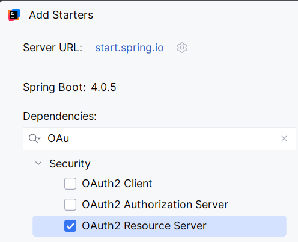

# Spring Security con autenticación externa — Supabase + JWT

## Arquitectura

En lugar de gestionar usuarios y roles en la base de datos del proyecto, delegamos
la autenticación a **Supabase**, que actúa como proveedor OAuth2/OIDC.

El flujo es el siguiente:

```
Cliente                  Supabase                  Tu API (Spring Boot)
  │                          │                            │
  │── POST /auth/token ──────▶│                            │
  │◀─ JWT (access_token) ────│                            │
  │                          │                            │
  │── GET /movies ───────────────────────────────────────▶│
  │   Authorization: Bearer <JWT>                         │
  │                          │                            │
  │                          │◀── valida firma del JWT ───│
  │                          │    con JWKS de Supabase    │
  │                          │                            │
  │◀─ 200 OK ────────────────────────────────────────────│
```

Tu API **nunca gestiona credenciales**. Solo valida el JWT que emite Supabase
comprobando su firma contra el endpoint JWKS público del proyecto.

---

## Distribución de acceso por rol

| Endpoint | Público | USER | ADMIN |
|---|---|---|---|
| `GET /movies` | ✅ | ✅ | ✅ |
| `GET /movies/{id}` | ✅ | ✅ | ✅ |
| `GET /actors` | ✅ | ✅ | ✅ |
| `GET /actors/{id}` | ✅ | ✅ | ✅ |
| `GET /movies/{id}/cast` | ✅ | ✅ | ✅ |
| `GET /actors/{id}/movies` | ✅ | ✅ | ✅ |
| `POST /movies` | ❌ | ✅ | ✅ |
| `POST /actors` | ❌ | ✅ | ✅ |
| `POST /movies/{id}/cast` | ❌ | ✅ | ✅ |
| `PATCH /movies/{id}/cast/{actorId}` | ❌ | ❌ | ✅ |
| `DELETE /movies/{id}/cast/{actorId}` | ❌ | ❌ | ✅ |
| `DELETE /movies/{id}` | ❌ | ❌ | ✅ |
| `DELETE /actors/{id}` | ❌ | ❌ | ✅ |

---

## Paso 1 — Configurar Supabase

### 1.1 Crear proyecto en Supabase

1. Accede a [https://supabase.com](https://supabase.com) y crea un proyecto nuevo.
2. Ve a **Authentication → Users** y crea dos usuarios de prueba:
   - `admin@demo.com` / `password123`
   - `user@demo.com` / `password123`

### 1.2 Añadir roles personalizados mediante metadatos

Supabase permite añadir metadatos a cada usuario. Los roles se incluyen en el JWT
bajo la claim `app_metadata`.

En **Authentication → Users**, edita cada usuario y añade en `app_metadata`:

```json
// admin@demo.com
{ "role": "ADMIN" }

// user@demo.com
{ "role": "USER" }
```

### 1.3 Localizar los datos de configuración

En **Settings → API** encontrarás:

| Dato | Dónde está | Para qué se usa |
|---|---|---|
| `Project URL` | Settings → API | Base de la URL de Supabase |
| `JWT Secret` | Settings → API → JWT Settings | Validar firma del token (HS256) |
| `anon key` | Settings → API | Obtener tokens desde Postman |

La URL del JWKS para validación es:
```
https://<PROJECT_REF>.supabase.co/auth/v1/.well-known/jwks.json
```

---

## Paso 2 — Dependencias Maven

Como estamos trabajando con IntelliJ, además de Spring Security añadimos el siguiente starter:



---

## Paso 3 — Configuración en `application.properties`

```properties
# URL del endpoint JWKS de Supabase (valida la firma del JWT)
spring.security.oauth2.resourceserver.jwt.jwk-set-uri=https://<PROJECT_REF>.supabase.co/auth/v1/.well-known/jwks.json

# Issuer del token (aparece en la claim "iss" del JWT)
spring.security.oauth2.resourceserver.jwt.issuer-uri=https://<PROJECT_REF>.supabase.co/auth/v1
```

> Sustituye `<PROJECT_REF>` por el identificador de tu proyecto Supabase,
> visible en la URL del dashboard o en Settings → API.

---

## Paso 4 — `SecurityConfig.java`

```java
@Configuration
@EnableWebSecurity
@EnableMethodSecurity   // habilita @PreAuthorize en los controladores
public class SecurityConfig {

    @Bean
    public SecurityFilterChain filterChain(HttpSecurity http) throws Exception {
        http
            .csrf(csrf -> csrf.disable())           // API REST — sin CSRF
            .sessionManagement(sm -> sm
                .sessionCreationPolicy(SessionCreationPolicy.STATELESS))
            .authorizeHttpRequests(auth -> auth
                // Endpoints públicos — sin autenticación
               
                // El resto requiere autenticación mínima (roles se comprueban con @PreAuthorize)
                .anyRequest().authenticated()
            )
            .oauth2ResourceServer(oauth2 -> oauth2
                .jwt(jwt -> jwt
                    .jwtAuthenticationConverter(jwtAuthenticationConverter())
                )
            );

        return http.build();
    }

    /**
     * Extrae el rol del claim "app_metadata.role" del JWT de Supabase
     * y lo convierte en un GrantedAuthority con prefijo ROLE_
     * para que @PreAuthorize("hasRole('ADMIN')") funcione correctamente.
     */
    @Bean
    public JwtAuthenticationConverter jwtAuthenticationConverter() {
        JwtAuthenticationConverter converter = new JwtAuthenticationConverter();
        converter.setJwtGrantedAuthoritiesConverter(jwt -> {
            List<GrantedAuthority> authorities = new ArrayList<>();
            // Supabase guarda los metadatos en la claim "app_metadata"
            Map<String, Object> appMetadata = jwt.getClaimAsMap("app_metadata");
            if (appMetadata != null && appMetadata.containsKey("role")) {
                String role = appMetadata.get("role").toString();
                authorities.add(new SimpleGrantedAuthority("ROLE_" + role));
            }
            return authorities;
        });
        return converter;
    }
}
```

---

## Paso 5 — Proteger los controladores con `@PreAuthorize`

### `MovieController.java`

```java
@RestController
@RequestMapping("/movies")
@RequiredArgsConstructor
public class MovieController {

    // Públicos — sin anotación de seguridad necesaria (ya cubierto en SecurityConfig)
    @GetMapping
    public List<MovieResponse> findAll() { ... }

    @GetMapping("/{id}")
    public MovieResponse findById(@PathVariable Long id) { ... }

    @GetMapping("/{id}/cast")
    public List<MovieCastResponse> getCast(@PathVariable Long id) { ... }

    // Solo USER y ADMIN pueden crear
    @PreAuthorize("hasAnyRole('USER', 'ADMIN')")
    @PostMapping
    public ResponseEntity<MovieResponse> create(@RequestBody MovieCreateRequest req) { ... }

    // Solo ADMIN puede modificar o borrar
    @PreAuthorize("hasRole('ADMIN')")
    @PatchMapping("/{id}/cast/{actorId}")
    public MovieCastResponse updateCast(@PathVariable Long id,
                                        @PathVariable Long actorId,
                                        @RequestBody MovieCastUpdateRequest req) { ... }

    @PreAuthorize("hasRole('ADMIN')")
    @DeleteMapping("/{id}/cast/{actorId}")
    public ResponseEntity<Void> removeCast(@PathVariable Long id,
                                           @PathVariable Long actorId) { ... }

    @PreAuthorize("hasRole('ADMIN')")
    @DeleteMapping("/{id}")
    public ResponseEntity<Void> delete(@PathVariable Long id) { ... }
}
```

### `ActorController.java`

```java
@RestController
@RequestMapping("/actors")
@RequiredArgsConstructor
public class ActorController {

    // Públicos
    @GetMapping
    public List<ActorResponse> findAll() { ... }

    @GetMapping("/{id}")
    public ActorResponse findById(@PathVariable Long id) { ... }

    @GetMapping("/{id}/movies")
    public List<MovieCastResponse> getMovies(@PathVariable Long id) { ... }

    // Solo USER y ADMIN pueden crear
    @PreAuthorize("hasAnyRole('USER', 'ADMIN')")
    @PostMapping
    public ResponseEntity<ActorResponse> create(@RequestBody ActorCreateRequest req) { ... }

    // Solo ADMIN puede borrar
    @PreAuthorize("hasRole('ADMIN')")
    @DeleteMapping("/{id}")
    public ResponseEntity<Void> delete(@PathVariable Long id) { ... }
}
```

---

## Paso 6 — Obtener tokens desde Postman

Supabase expone un endpoint REST para autenticación. Úsalo para obtener el JWT
antes de llamar a los endpoints protegidos.

### Obtener token

```http
POST https://<PROJECT_REF>.supabase.co/auth/v1/token?grant_type=password
Content-Type: application/json
apikey: <SUPABASE_ANON_KEY>

{
  "email": "admin@demo.com",
  "password": "password123"
}
```

La respuesta incluye `access_token`. Cópialo y úsalo como Bearer token:

```http
Authorization: Bearer <access_token>
```

---

## Plan de pruebas de seguridad

### Pruebas sin token (público)

```http
GET /movies          → ✓ 200  (público)
GET /movies/1        → ✓ 200  (público)
GET /actors          → ✓ 200  (público)
GET /actors/1        → ✓ 200  (público)
POST /movies         → ✓ 401  (requiere autenticación)
DELETE /movies/1     → ✓ 401  (requiere autenticación)
```

### Pruebas con token USER

```http
POST /movies         → ✓ 201  (USER puede crear)
POST /actors         → ✓ 201  (USER puede crear)
POST /movies/1/cast  → ✓ 201  (USER puede crear)
PATCH /movies/1/cast/1  → ✓ 403  (USER no puede modificar)
DELETE /movies/1        → ✓ 403  (USER no puede borrar)
```

### Pruebas con token ADMIN

```http
POST /movies            → ✓ 201
PATCH /movies/1/cast/1  → ✓ 200  (ADMIN puede modificar)
DELETE /movies/1/cast/2 → ✓ 204  (ADMIN puede borrar)
DELETE /movies/1        → ✓ 204  (ADMIN puede borrar)
```

---

## Checklist de entrega

- [ ] Dependencias `spring-boot-starter-security` y `oauth2-resource-server` añadidas
- [ ] `application.properties` configurado con la URL JWKS del proyecto Supabase
- [ ] `SecurityConfig` con endpoints públicos y el resto autenticados
- [ ] `JwtAuthenticationConverter` extrae el rol de `app_metadata`
- [ ] Controladores protegidos con `@PreAuthorize`
- [ ] Prueba sin token en endpoint protegido devuelve `401`
- [ ] Prueba con token USER en endpoint ADMIN devuelve `403`
- [ ] Prueba con token ADMIN en endpoint ADMIN devuelve `200`/`204`
