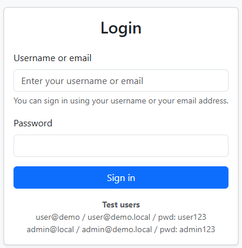
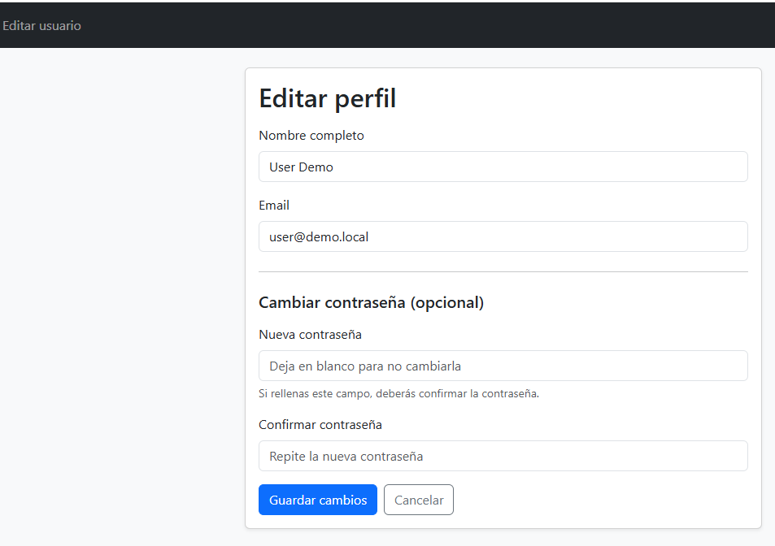
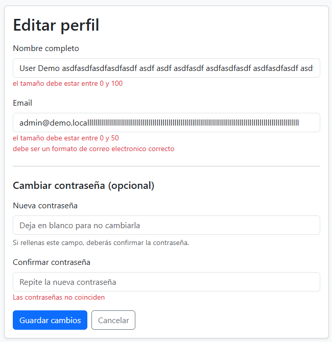

# EventHubMVC

Usuarios de prueba: 

- Username: user@demo · Email: user@demo.local · Pwd: user123
- Username: admin@local · Email: admin@demo.local · Pwd: admin123

## 1. Securizar la aplicación

Debes securizar la aplicación para que cualquier página de la aplicación requiera autenticación (excepto la página de login y recursos estáticos necesarios).

Modifica el proceso de autenticación para que un usuario pueda iniciar sesión utilizando su nombre de usuario o su email (ambos deben funcionar). 

Debe ser posible iniciar sesión tanto con el Username como con el Email de los usuarios de prueba.



## 2. Edición de perfil

Implementa una funcionalidad “Editar usuario” que permita a un usuario autenticado modificar los datos de su perfil desde la aplicación web. Se editarán únicamente fullName, email y password.

La solución debe estar integrada en el flujo MVC existente y cumplir los siguientes criterios:

- Debe añadirse un acceso a esta funcionalidad desde la interfaz cuando el usuario esté autenticado (en el menú).
- Los datos actuales del usuario deben mostrarse en el formulario de edición. Utiliza y amplía profile/edit.html




- La contraseña solo debe modificarse si el usuario decide cambiarla.
- Al cargarse el formulario de edición aparecerá solo el nombre completo y el email, las contraseñas no aparecen visibles. Observa la captura.

Tras una actualización correcta, el usuario debe ser redirigido al formulario indicando que se ha actualizado correctamente el perfil.


### Validaciones

- El nombre completo y el email deben validarse correctamente, acorde a las restricciones del modelo.
- Implementa todas las validaciones que puedes ver en la captura de pantalla.
- El email no puede coincidir con el de otro usuario del sistema.
- Los errores de validación deben mostrarse en el formulario acorde a las capturas de pantalla.



Flujo completo:

```
POST /profile/edit
      ↓
Spring mapea formulario → DTO
      ↓
Validación automática
      ↓
Validación manual password
      ↓
¿Errores?
      ├─ SI → volver a profile/edit
      └─ NO
            ↓
buscar usuario autenticado
            ↓
actualizar perfil
            ↓
añadir flash message
            ↓
redirect:/profile/edit

```

--- 

## 3. MEJORAS EN LA COMPRA DE EVENTOS. CARRITO

### 3.1 Aviso de compra

Actualmente, al añadir entradas al carrito, el usuario no recibe ninguna confirmación visual. 

Implementa la funcionalidad necesaria para que, tras añadir un tipo de entrada, se muestre en la página de detalle del evento un mensaje de éxito indicando la cantidad de entradas añadidas (según el valor introducido en el formulario):

<code> "Added X ticket(s) to your cart."</code>

[Flash Attributes y el patrón PRG](./prg.md)

### 3.2. Validación server-side real de compra

Adapta la aplicación para garantizar que, al añadir entradas al carrito:
- No se pueda superar el número máximo permitido por la categoría del tipo de entrada.
- Si el tipo de entrada ya existe en el carrito, la cantidad total resultante tampoco supere dicho límite.
- En caso de intento no válido:

      - El carrito no debe modificarse.
      - Debe mostrarse un mensaje informativo en la página de detalle del evento 
            <code>“You can buy at most 4 ticket(s) for VIP. You already have 3 in your cart.”</code>
      - El mensaje debe mostrarse una sola vez y desaparecer al recargar la página.

### 3.3. Descuento por completar entradas VIP

Las entradas de categoría VIP tienen un límite máximo de 4 unidades por compra.

Para incentivar que el usuario complete dicho máximo, se debe aplicar una regla de descuento con las siguientes condiciones:
- Si antes de añadir nuevas entradas, el carrito ya contiene 3 entradas VIP, las nuevas entradas VIP añadidas se benefician de un 10 % de descuento.
- El descuento se aplica únicamente a las entradas añadidas en esa operación, no a las que ya estaban en el carrito.
- Si el carrito no cumplía previamente la condición (por ejemplo, estaba vacío), no se aplica descuento, aunque se añadan 4 entradas VIP de una sola vez.
- Ejemplo:

      - Si el carrito contiene 3 entradas VIP y se añade 1 más, esa nueva entrada VIP se añade con un 10 % de descuento.
      - Si el carrito está vacío y se añaden 4 entradas VIP de una sola vez, no se aplica descuento.
      - En el carrito debe mostrarse una línea diferenciada para las entradas con descuento (aunque correspondan al mismo tipo de entrada) y, tras la operación, debe mostrarse un mensaje informativo en el detalle del evento indicando que se ha aplicado el descuento

---

## Mejora en el carrito

- Lo ideal es usar un CartService.
- El controlador se encarga de la petición http, llamaría al servicio, redirects...
- CartService el método addToCart(...)
- Cart(modelo de sesión): operaciones simples sin reglas de negocios
- Incluso podríamos separar en varios servicios, uno específico para el precio.

Propuesta:

```
service/
  CartService.java          ← lógica de negocio
  result/
    CartResult.java         ← resultado tipado
controller/
  CartController.java       ← solo concerns web
```

