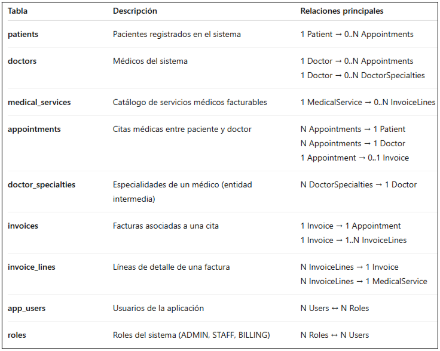
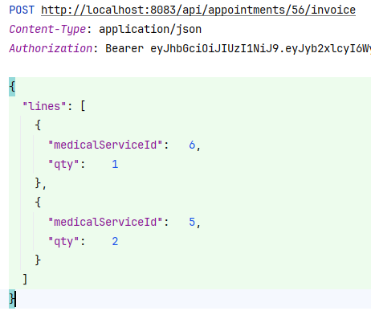
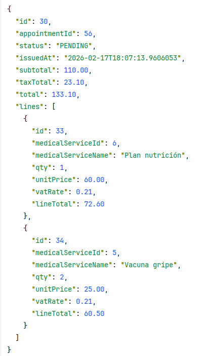

# Prueba individual evaluable de Spring 

Todos los endpoints son públicos. Si tenéis problemas para configurar la SEGURIDAD, dejadlos públicos.

USUARIOS DE PRUEBA (login y pwd iguales): admin, staff, billing

## Modelo completo del dominio



## 1. ENTIDADES JPA

Debes diseñar correctamente las relaciones bidireccionales JPA junto con los métodos java correspondientes, entre Doctor y DoctorSpecialty. 

CORRIGE los errores JPA. Haz la VALIDACIÓN.

```
CREATE TABLE doctors (
                         id BIGINT GENERATED BY DEFAULT AS IDENTITY PRIMARY KEY,
                         license_number VARCHAR(40) NOT NULL,
                         full_name VARCHAR(120) NOT NULL,
                         email VARCHAR(150) NOT NULL,
                         active BOOLEAN NOT NULL
);

CREATE UNIQUE INDEX uk_doctor_license ON doctors(license_number);

-- -------------------------
-- DOCTOR_SPECIALTIES (entity intermedia con PK compuesta)
-- PK: (doctor_id, specialty)
-- -------------------------
CREATE TABLE doctor_specialties (
                                    doctor_id BIGINT NOT NULL,
                                    specialty VARCHAR(30) NOT NULL,
                                    level VARCHAR(20) NOT NULL,
                                    active BOOLEAN NOT NULL,
                                    since_date DATE NOT NULL,
                                    consultation_fee_override DECIMAL(12,2),

                                    CONSTRAINT pk_doctor_specialties PRIMARY KEY (doctor_id, specialty),
                                    CONSTRAINT fk_doctor_specialties_doctor
                                        FOREIGN KEY (doctor_id) REFERENCES doctors(id)
);
```

## 2. EMITIR FACTURA DE UNA CITA (crear Invoice + líneas)

```
POST http://localhost:8083/api/appointments/{id}/invoice
```

Crear factura a partir de una cita y sus servicios médicos. 

La creación de la factura y sus líneas debe ser atómica  (Prueba con la cita con id 56)


Parte de *InvoiceController* y ve completando los fuentes pertienentes. Completa, no machaques.

La factura debe persistirse junto con todas sus líneas en la base de datos en la misma operación. Mantener bidireccionalidad.

**Seguridad:**El usuario solo con rol ADMIN o BILLING. 


1. No puede haber servicios duplicados en el json request; si no → BadRequestException (400)
2. La cita debe existir; si no → NotFoundException (404).
3. La cita no puede estar ya facturada; si no → ConflictException (409). 
4. La cita no puede estar CANCELLED. si no → BussinessRuleException (422).
5. La cita debe estar COMPLETED si no → BussinessRuleException (422).
6. Cada medicalServiceId debe existir y estar active=true; si no: inexistente → 404 / inactivo → 422 (el primero que falle)
7. Las líneas de factura se emitirán sin aplicar ningún tipo de descuento.
8. El tipo de IVA aplicado en las líneas de factura será siempre del 21% (VAT_21). El cálculo de impuestos y totales debe realizarse en el servidor.
9. Los importes económicos deberán redondearse a dos decimales siguiendo el redondeo estándar.


### Request



### Response


